# Rapport Final

## {+ Introduction +} :

Ce projet vise à extraire, enrichir et analyser automatiquement des articles issus de flux RSS journalistiques de 2025. En combinant les outils de traitement du langage naturel (comme Trankit, Gensim, BERTopic et encore d'autres) et des méthodes de modélisations thématiques.

Ce rapport présente les étapes clés du projet, les choix techniques effectués, ainsi que les résultats obtenues et leurs limites.

Voilà un graphe simple qui représente la vue d'ensemble du projet :

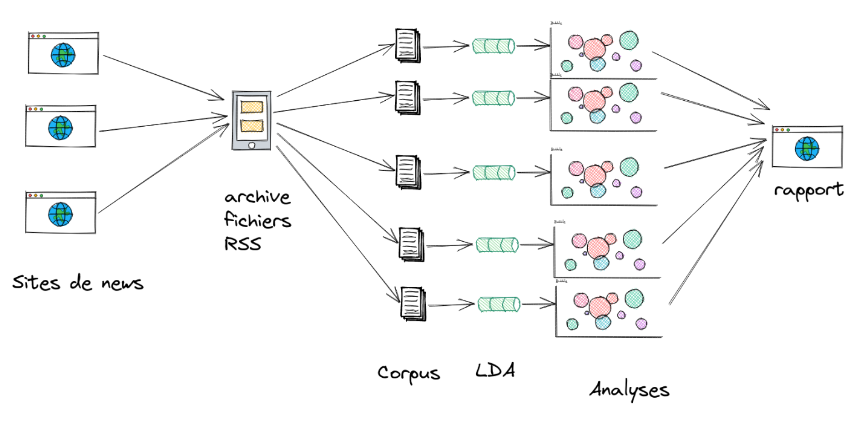

(source : diapo "07-topics-modeling1.pdf")


---
---

### {- BàO 1 – gestion des données et du code -}

* **Contexte du projet** : Extraction et modélisation thématique de données issues de flux RSS journalistiques.

La première étape consiste de pouvoir lire et manipuler les données fournis au format XML (RSS). Il faut alors extraire le texte à analyser ainsi que les métadonnées qu'on aura besoin lors du filtrage. Les métadonnées qu'on garde sont : l'identifiant, la source, le titre de l'article, le contenu de l'article, la date dee publication et les catégories.

* **Composition de l’équipe et rôles**

Chaque personne a dû écrire une partie différente du programme à partir de librairie python différentes, mais qui font la même tâche. Le travail a été divisé en 3 rôles majeurs (R1, R2, R3).

* **Bibliothèques utilisés** : Python, GitLab, feedparser, re, etree, os, pahtlib, glob.

* **Scripts utilisés** :
  * `rss_reader.py`, `rss_parcours.py` : pour l'extraction (récursive) des flux RSS.
      * `rss_reader.py` [lien vers le script](https://gitlab.com/plurital-ppe2-2025/groupe11/Projet/-/blob/main/rss_reader.py#L11-115) : permet d'extraire les données d'un seul flux RSS.
      * `rss_parcours.py` [lien vers le script](https://gitlab.com/plurital-ppe2-2025/groupe11/Projet/-/blob/main/rss_parcours.py?ref_type=heads#L9-51) : permet d'extraire les données pour un ensemble de flux RSS et attend en entrée un dossier contenant plusieurs fichiers.

  * Débogage et relecture collaboratif, gestion des dépendances et erreurs courantes.
  * Gestion du code avec Git avancé : historique Git, conflits, évolution des scripts.

---
---

### {- BàO 2 – enrichir les données -}

La seconde étape est d'enrichir les données avec les sorties de différents analyseurs morphosyntaxiques : `SpaCy`, `Stanza` et `Trankit`. Ces outils permettent d’extraire des informations linguistiques telles que les lemmes, les catégories grammaticales, etc. Ces résultats permettent de construire une représentation plus solide et précise des structures linguistiques contenues dans les données.

* **Structure initiale des fichiers RSS**.
* **Nettoyage et prétraitement** :
  * Agrégation des données
  * Suppression des doublons : grâce à la [fonction `supprimer_doublons()`](https://gitlab.com/plurital-ppe2-2025/groupe11/Projet/-/blob/main/rss_parcours.py?ref_type=heads#L115)

  ```python
  def supprimer_doublons(articles):
	"""Supprime les doublons d'articles basés sur leur l'id"""
	vus = set()
	uniques = []
	for article in articles:
		cle = getattr(article, 'id', None)
		if cle and cle not in vus:
			vus.add(cle)
			uniques.append(article)
	return uniques
    ```

  * Sauvegarde au format XML, Json et Pickle :
    Voici des exemples de fichiers après la sauvegarde en fonction des formats :
      - Sauvegarde en XML [fichier xml](corpus_février.xml)
      - Sauvegarde en JSON [fichier_json](corpus_février.json)
      - Sauvegarde en Pickle [fichier_pickle](corpus_février.pickle)

* **Analyse automatique** :
  * Scripts :
    - `datastructures.py` : contient les différentes @dataclass afin de stocker des valeurs et créer une structure aux données.
    - `analyzers.py` : enrichi avec le résultat de l'analyse.
  * Représentation des objets à partir de [@dataclass](https://gitlab.com/plurital-ppe2-2025/groupe11/Projet/-/blob/main/datastructures.py?ref_type=heads#L9-186): `Article`, `Token`, `Corpus`.
  * Lemmatization et morphosyntaxe via [spacy](https://gitlab.com/plurital-ppe2-2025/groupe11/Projet/-/blob/main/analyzers.py?ref_type=heads#L74-83), [stanza](https://gitlab.com/plurital-ppe2-2025/groupe11/Projet/-/blob/main/analyzers.py?ref_type=heads#L60-68) et [Trankit](https://gitlab.com/plurital-ppe2-2025/groupe11/Projet/-/blob/main/analyzers.py?ref_type=heads#L21-47) (POS, lemme).
  * Problèmes :
    - Trankit demande une ancienne version de python. Cela signifie de créer un nouvel environnement virtuel ayant la version de python adapté afin d'utiliser la librairie Trankit.

* **Filtrage sur métadonnées** :
  * Création de sous-corpus filtré :

  On avait plusieurs filtres au choix : filtre en fonction des [dates](https://gitlab.com/plurital-ppe2-2025/groupe11/Projet/-/blob/main/rss_reader.py?ref_type=heads#L118-141), des [catégories](https://gitlab.com/plurital-ppe2-2025/groupe11/Projet/-/blob/main/rss_reader.py?ref_type=heads#L144-150) et la [source](https://gitlab.com/plurital-ppe2-2025/groupe11/Projet/-/blob/main/rss_reader.py?ref_type=heads#L152-166).

  Tous ces filtres ont été rassemblé dans une nouvelle fonction `filtrage()` :

  ```python
      def filtrage(articles, date_debut=None, date_fin=None, sources=None, categories=None):
        """Applique tous les filtres spécifiés aux articles"""
        articles_filtres = []
        id_unique = set()

        for article in articles:
            # Vérifier tous les filtres applicables
            if date_debut is not None or date_fin is not None:
                if not filtre_date(article, date_debut, date_fin):
                    continue

            if sources:
                if not filtre_source(article, sources):
                    continue

            if categories:
                if not filtre_categories(article, categories):
                    continue

            # Si l'article passe tous les filtres et n'est pas un doublon
            if article.id not in id_unique:
                id_unique.add(article.id)
                articles_filtres.append(article)

        return articles_filtres
    ```

  Pour ce projet, le corpus original est `Corpus au 2 avril 2025`. Nous avons décidé de le filtrer en fonction des dates, en conservant que les mois de février et de mars. Ce filtrage nous a semblé pertinent pour analyser l'évolution des thématiques au fil du temps. Ce découpage permet de comparer les dynamiques informationnelles selon les périodes, de repérer des intérêts autour de certains sujets, ou encore de limiter les effets de surreprésentation de thèmes liés à des événements ponctuels. Il renforce ainsi la pertinence de l’analyse thématique en contextualisant les résultats dans une chronologie cohérente.

  Voici un exemple de commandes utilisées pour obtenir les sous-corpus :
     ```python3 rss_parcours.py 2025/ glob etree --start-date 2025-02-01 --end-date 2025-02-28 --output corpus02.json```

      ```python3 rss_parcours.py 2025/ glob etree --start-date 2025-03-01 --end-date 2025-03-31 --output corpus_mars.json```

  On a donc 2 sous-corpus : `sous-corpus_février` et `sous-corpus_mars`. On obtient environ 10000 articles au total.

---
---

### {- BàO 3 – Visualisation -}

L’étape suivante consiste à explorer le topic modeling, une méthode qui permet d’identifier automatiquement les grandes thématiques présentes dans un corpus de documents. Dans le cadre de ce projet, nous avons utilisé deux modèles de topic modeling : LDA (*Latent Dirichlet Allocation*) et BERTopic.

- LDA : un modèle bayésien qui repose sur l’hypothèse que les sujets (topics) génèrent à la fois les documents et les mots. Au cours de ce projet, nous avons appris à extraire simultanément les thématiques principales et les termes qui leur sont associés.

- BERTopic : Les documents similaires proviennent de sujets communs, à partir desquels on extrait les termes les plus spécifiques. BERTopc se repose sur une technique de modélisation thématique qui adapte et transforme le c-TF-IDF afin de former des clusters denses. Elle permet ainsi de générer des sujets facilement interprétables tout en préservant les mots clés significatifs dans les descriptions.

BERTopic peut être considéré comme une séquence d'étapes pour créer ses représentations de topics. Ce processus comporte cinq étapes:

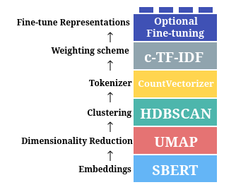 *(source : [https://maartengr.github.io/BERTopic/algorithm/algorithm.html](https://maartengr.github.io/BERTopic/algorithm/algorithm.html))*

* **Visualisation par corpus** :

  - **Corpus février** :

    Voici nos différentes visualisations obtenues pour le corpus de février :
    * [Visualisation des topics](https://gitlab.com/plurital-ppe2-2025/groupe11/Projet/-/blob/main/sous-corpus_f%C3%A9vrier/topics_corpus_f%C3%A9vrier_analyzed.html?ref_type=heads)
    * [Visualisation hiérarchique des topics](https://gitlab.com/plurital-ppe2-2025/groupe11/Projet/-/blob/main/sous-corpus_f%C3%A9vrier/hierarchical_topics_corpus_f%C3%A9vrier_analyzed.html?ref_type=heads)
    * [Visualisation de tous les documents et leur topic](https://gitlab.com/plurital-ppe2-2025/groupe11/Projet/-/blob/main/sous-corpus_f%C3%A9vrier/topics_embeddings_corpus_f%C3%A9vrier_analyzed.html?ref_type=heads)
    * [Visualisation de la heatmap des similarités entre topics](https://gitlab.com/plurital-ppe2-2025/groupe11/Projet/-/blob/main/sous-corpus_f%C3%A9vrier/topics_heatmap_corpus_f%C3%A9vrier_analyzed.html?ref_type=heads)
    * [Visualisation des topics par classe de corpus février selon les catégories](https://gitlab.com/plurital-ppe2-2025/groupe11/Projet/-/blob/main/sous-corpus_f%C3%A9vrier/topics_per_class_categories_corpus_f%C3%A9vrier_analyzed.html?ref_type=heads)
    * [Visualisation des topics par classe de corpus février selon les sources](https://gitlab.com/plurital-ppe2-2025/groupe11/Projet/-/blob/main/sous-corpus_f%C3%A9vrier/topics_per_class_sources_corpus_f%C3%A9vrier_analyzed.html?ref_type=heads)

  - **Corpus mars** :

    Voici nos différentes visualisations obtenues pour le corpus de mars :
    * [Visualisation des topics](https://gitlab.com/plurital-ppe2-2025/groupe11/Projet/-/blob/main/sous-corpus_mars/topics_corpus_mars_analyzed.html?ref_type=heads)
    * [Visualisation hiérarchique des topics](https://gitlab.com/plurital-ppe2-2025/groupe11/Projet/-/blob/main/sous-corpus_mars/hierarchical_topics_corpus_mars_analyzed.html?ref_type=heads)
    * [Visualisation de tous les documents et leur topic](https://gitlab.com/plurital-ppe2-2025/groupe11/Projet/-/blob/main/sous-corpus_mars/topics_embeddings_corpus_mars_analyzed.html?ref_type=heads)
    * [Visualisation de la heatmap des similarités entre topics](https://gitlab.com/plurital-ppe2-2025/groupe11/Projet/-/blob/main/sous-corpus_mars/topics_heatmap_corpus_mars_analyzed.html?ref_type=heads)
    * [Visualisation des topics par classe selon les catégories](https://gitlab.com/plurital-ppe2-2025/groupe11/Projet/-/blob/main/sous-corpus_mars/topics_per_class_categories_corpus_mars_analyzed.html?ref_type=heads)
    * [Visualisation des topics par classe selon les sources](https://gitlab.com/plurital-ppe2-2025/groupe11/Projet/-/blob/main/sous-corpus_mars/topics_per_class_sources_corpus_mars_analyzed.html?ref_type=heads)

- **Explication des visualisations** :

    * `visualize_topics()` : La visualisation des topics nous permet de voir la distance intertopic : c'est-à-dire la distance qui sépare chaque topic les uns des autres. Ces topics sont représentés par des cercles plus ou moins proches entre eux. Plus ils sont proches, plus leur score de similarité est grand.

    * `visualize_hierarchy()` : La visualisation hiérarchique des topics se présente sous forme d'un arbre, où chaque noeud représente un topic "représentatif". Les branches qui partent de ce noeud correspondent alors à des topics plus spécifiques de ce même sujet. Ainsi avec cette visualisation on peut voir des groupes de topic : par exemple, un noeud d'où partent tous les topics de type actualité sportive.

    * `visualize_documents()` : La visualisation de tous les documents (embeddings) affiche tous les documents, avec en légende tous les topics. Les documents sont colorés en fonction de leur topic. On peut aussi voir la distance entre chaque document selon la similarité de leur topic. On a ainsi des clusters avec tous les documents de même topic.

    * `visualize_heatmap()` : La visualisation de la heatmap permet de montrer la similarité entre deux topics. Cette heatmap est sous forme de grille avec sur l'axe x et y les topics. La diagonale représente l'endroit où un topic se recoupe avec lui-même, donc à cet endroit la similarité est de 1 : le maximum. Plus deux topics sont similaires, plus leur score de similarité est grand et par conséquent plus le bleu est intense sur la heatmap.

    * `visualize_topics_per_class()` : La visualisation des topics par classe permet de regrouper les topics selon des classes que l'on définit. Nous avons décidé d'effectuer deux fois cette visualisation : une fois en prenant les catégories des articles comme classes, et une autre fois en prenant les sources des articles comme classes. Cela nous permet de voir la répartition des topics selon les catégories ou les sources des articles.


---
---

### {- BàO 4 – Analyse -}

Dans cette section, nous analysons plusieurs corpus afin d’en dégager les grandes thématiques, les différences lexicales et les spécificités de chacun. Grâce à des méthodes d’analyse automatique, notamment le topic modeling, nous identifions les sujets les plus fréquents et comparons leur répartition entre les différents corpus. Cette approche permet de mieux comprendre le contenu de chaque ensemble de textes, tout en mettant en lumière les points communs et les différences qui les caractérisent.

> **LDA**

* **Modélisation thématique avec LDA** :
  * Script : `run_lda.py`
  * Outils : Gensim
  * Prétraitement : tokénisation, stopwords, lemmatisation, bigrammes.

* **Analyse des résultats** :
    
     Analysons les résultats que nous avons obtenu avec le script LDA. Nous avons choisi de garder les dix topics les plus fréquents pour les deux sous-corpus.

    - **Corpus février** :
    
    Voici notre visualisation LDA pour le corpus de février :
    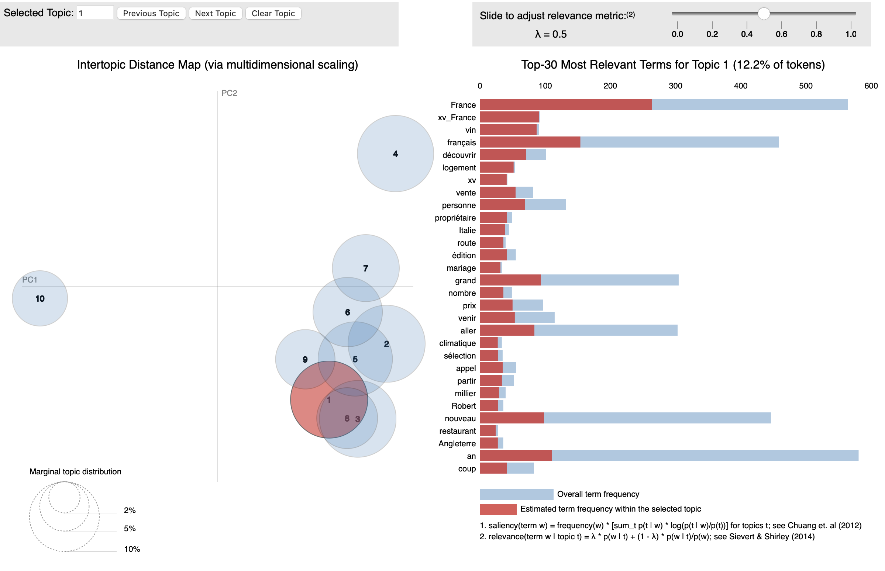


    Le résultat de visualisation LDA montre ici un modèle à 10 topics, dans lequel le topic 1 représente 12,2% des tokens du corpus – ce qui en fait un des sujets dominants. Sur la carte de gauche, nous observons que le topic 1 est regroupé avec les topics 2, 3, 5, 6, 8 et 9, ce qui suggère une proximité sémantique. Le topic 10, isolé en haut à gauche, semble thématiquement distinct. Le topic 4 est également un peu éloigné, indiquant une certaine indépendance thématique.

    Le curseur λ (lambda) contrôle le critère de sélection des mots-clés :

    λ = 1 (réglage actuel) : les mots sont classés selon leur fréquence dans le topic (représentativité interne) ;

    λ = 0 : les mots sont classés selon leur spécificité au topic (exclusivité thématique) ;

    λ = 0.5 : compromis entre les deux.

    Modifier λ permet donc de varier le point de vue sur les topics : soit en favorisant les mots les plus fréquents, soit en mettant en avant ceux qui différencient vraiment un topic des autres.

    La barre rouge indique la fréquence estimée du terme dans le topic sélectionné ; La barre bleue indique la fréquence du même terme dans l’ensemble du corpus.


   * Problèmes et réflexions critiques :

    Le graphique à barres à droite présente les 30 termes les plus fréquents pour le topic 1. Parmi eux, on retrouve des mots comme "vin" ou "xv_France" sont très fréquents, mais rares dans les autres topics. Ces termes sont donc fortement spécifiques au Topic 1 et peuvent être considérés comme des indicateurs sémantiques clés de ce cluster.
    
    Bien que le Topic 1 contienne plusieurs termes cohérents comme “France”, “français”, “xv_France”, qui renvoient clairement à un topic sportif, notamment le rugby (XV de France), on observe également la présence de termes d’un tout autre domaine, tels que “logement”, “propriétaire”, “prix”, qui relèvent plutôt du champ social et économique.

    On peut donc en conclure que le Topic 1 reflète une agrégation partiellement bruitée, où la frontière entre les sujets n’est pas suffisamment nette. Cela pourrait s’expliquer par un manque de granularité dans les embeddings, un nombre de topics trop faible, ou encore un corpus où les thèmes sont souvent entremêlés.


    - **Corpus mars** :

   Analysons les résultats que nous avons obtenu avec le script LDA. Nous avons choisi de garder les dix topics les plus fréquents pour les deux sous-corpus.

  Voici notre visualisation LDA pour le corpus de mars :
  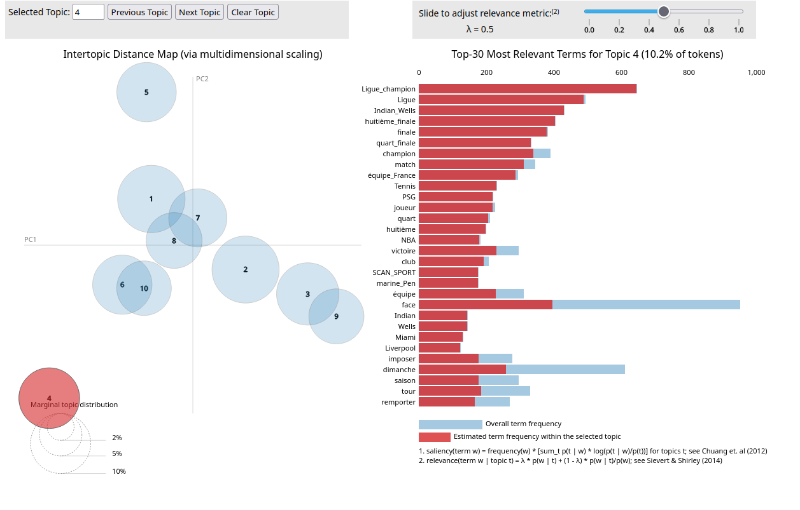

  Nous voyons ici les différents topics, et la distance qu'il y a entre chacun d'entre eux. Nous voyons sur l'image le topic 4, qui semble représenter un sujet sportif comme on peut le voir avec les termes "ligue_champion", "PSG", "Tennis", etc. Nous avons le terme "marine_pen" qui semble être une valeur aberrante. On observe que certains termes sont plus spécifiques que d'autres : par exemple "ligue_champion" est plus spécifique que "dimanche" car on voit que pour le premier terme, la fréquence du terme au sein du topic est quasi la même que la fréquence total tout topic confondu, contrairement à "dimanche" dont la fréquence relative au topic est égale à moins de la moitié de la fréquence total du terme.

  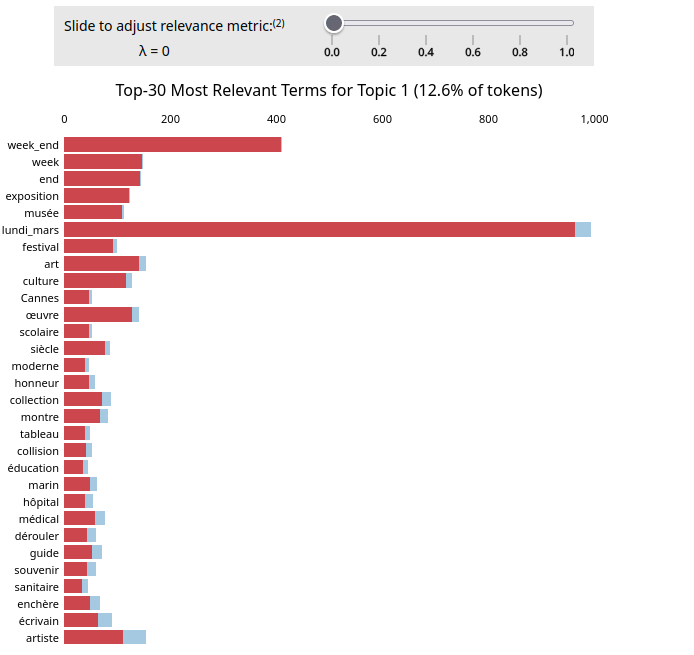

  Dans cette image, on voit le topic 1. Même en mettant lambda à 0 pour essayer d'avoir les termes les plus spécifiques, il est difficile de dégager un thème dans ce topic. Il a l'air d'être lié à la culture et l'art, mais on a des mots comme "médical" qui sont surprenants.

  Voici le fichier texte comprenant les dix premiers topics : [fichier txt](https://gitlab.com/plurital-ppe2-2025/groupe11/Projet/-/blob/main/sous-corpus_mars/topics_lda_mars.txt?ref_type=heads)

  On remarque que la plupart des topics sont de nature politique.

  * Problèmes et réflexions critiques.

  La cohérence des topics laisse à désirer, comme on peut le voir pour ce topic :
  ``` ([(0.04971674, 'mardi_mars'),
   (0.032919217, 'Ligue_champion'),
   (0.024989448, 'Ligue'),
   (0.023180215, 'mardi'),
   (0.021951461, 'Indian_Wells'),
   (0.02061948, 'huitième_finale'),
   (0.01889684, 'finale'),
   (0.018644499, 'champion'),
   (0.016960604, 'quart_finale'),
   (0.013903567, 'face'),
   (0.012283185, 'match'),
   (0.011748097, 'Tennis'),
   (0.011277011, 'aller'),
   (0.011032933, 'PSG'),
   (0.010640536, 'quart'),
   (0.01043116, 'Volodymyr_Zelensky'),
   (0.010086553, 'huitième'),
   (0.009983057, 'maison_Blanche'),
   (0.009931014, 'premier'),
   (0.008338351, 'retour')],
   ```

  On pense au début avoir affaire à un topic de type sportif, avec des mots comme "ligue_champion", "finale", "match", mais à la fin on a des mots comme "maison_blanche" et "Volodymyr_Zelensky".
  On aussi la présence de mots comme "mardi_mars", "lundi" etc, qui n'apportent pas vraiment à l'analyse du topic et qu'on aurait pu filtrer en amont.


**--------------------------------------------------------------------------**

> **BERTopic**

* **Modélisation thématique avec BERTopic** :
  * Script : `bertopicdemo.py`
  * Outils : Gensim ...
  * Prétraitement : Extraction des embeddings, réduire la dimensionnalité, regrouper les embeddings réduites, tokenisation + supprimer des stopwords, finetunning (optionnel).
  * Modèle Hugging face : [sentence-transformers/paraphrase-multilingual-MiniLM-L12-v2](https://huggingface.co/sentence-transformers/paraphrase-multilingual-MiniLM-L12-v2)

* **Analyse des résultats** :

    - **Corpus février** :
  Pour le corpus de février, nous avons 81 topics avec BERTopic.

  Voici les clusters pour les topics de février :

  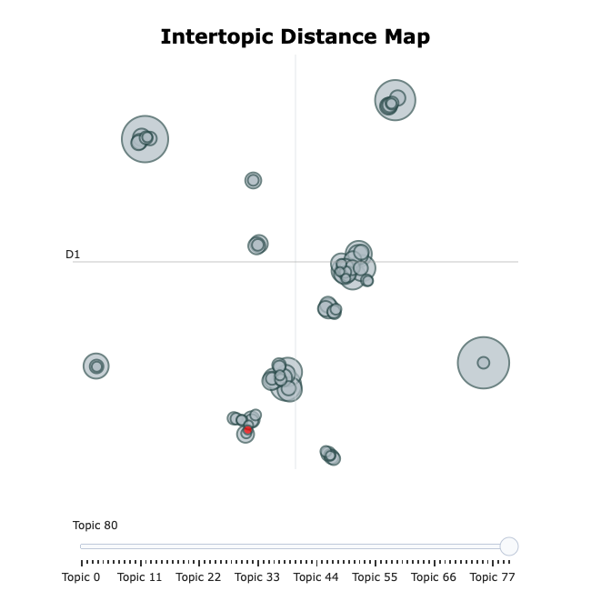

  Dans l'Intertopic Distance Map, on observe plusieurs regroupements distincts de topics qui correspondent à des domaines thématiques spécifiques.

  Le cluster en bas à gauche est clairement lié au domaine sportif, comme en témoignent les mots-clés du Topic 0 (« ligue », « champions », « barrage », « club ») ou encore du Topic 35, davantage lié au sport économique et aux investissements (« euros », « investir », « actionnaires »). Ces topics sont proches spatialement, indiquant une certaine similarité sémantique, même si leurs tailles varient fortement (par exemple Topic 0 avec une taille de 155, et Topic 35 seulement 14).

  Le cluster en haut à gauche est davantage orienté vers la technologie et l’intelligence artificielle, comme le montre le Topic 1 (« artificielle », « intelligence », « IA », « sommet », « décryptage »). Ce cluster est spatialement isolé, indiquant une spécificité sémantique plus forte de ce groupe.

  Au centre, on distingue un regroupement dense de petits topics dont les tailles et contenus sont variés. Cela peut indiquer une zone de thèmes plus diversifiés ou plus généraux, moins facilement catégorisables, mais traitant d’actualités ou de sujets transversaux.

  Enfin, la dispersion de certains topics (comme ceux situés à l'extrême gauche ou en bas à droite) souligne des thématiques mal intégrées ou hétérogènes, qui mériteraient peut-être d’être regroupées différemment (par exemple des mélanges entre des sujets météorologiques et culturels, ou encore économiques et sociaux).

  Cette visualisation met en évidence la capacité du modèle à regrouper de façon cohérente les thèmes dominants du corpus, tout en révélant certaines limites ou zones d’ambiguïté dans le clustering automatique.
  
  Voici un aperçu de l’analyse de hierarchical clustering sur les topics du corpus de février:

  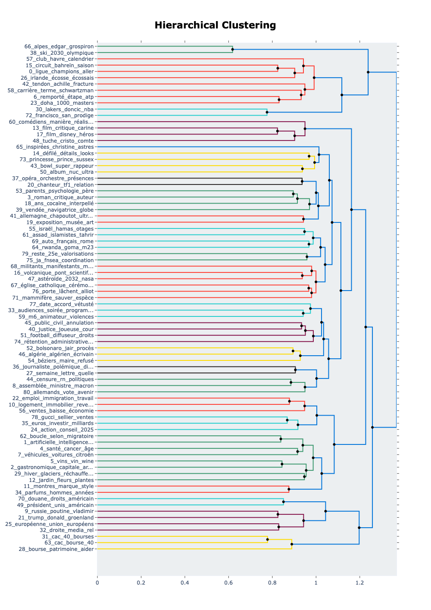
    Ce dendrogramme nous permet de visualiser les similarités sémantiques entre les différents topics extraits par BERTopic. Chaque ligne horizontale correspond à un topic identifié par un numéro et des mots-clés représentatifs. Les points de jonction (nœuds noirs) indiquent le regroupement de deux topics en un cluster plus large. 
    
    En survolant ces nœuds, on peut voir apparaître un nom de regroupement généré automatiquement, ce qui permet d’interpréter rapidement le thème global du cluster. Par exemple, les topics `66_alpes_edgar_grospiron` et `38_ski_2030_olympique` sont regroupés très tôt avec l’étiquette `2030_alpes_jo_comité_ski`, suggérant une forte proximité lexicale autour des Jeux Olympiques d’hiver. 
    
    Ce type de visualisation aide donc à mieux comprendre la structure hiérarchique des sujets traités dans le corpus, à identifier les thèmes centraux (branches courtes) ainsi que les sujets plus marginaux ou spécifiques (branches longues). 


    - **Corpus mars** :

  Pour le corpus de mars, nous avons 142 topics avec BERTopic.

  Voici les clusters pour les topics de mars :

  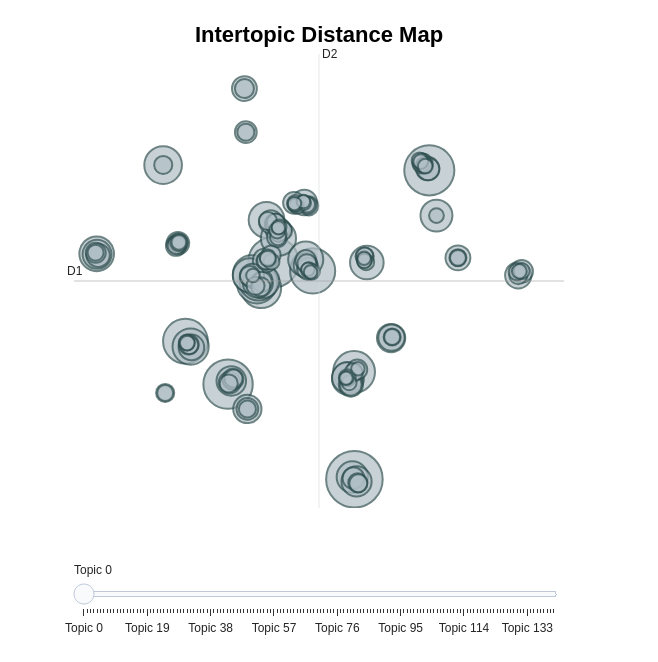

  Le cluster le plus en bas représente les articles sportifs, tandis que le cluster au centre du carré en haut à droite représente les articles culturels, artistiques. On voit que ces clusters regroupent beaucoup de topics. Nous avons aussi des clusters un peu moins denses, comme celui le plus en haut, qui regroupe deux topics parlant de jardinage et de plantes.
  Il y a aussi des topics qui sont regroupés ensemble mais qui ne devraient pas l'être : le cluster tout à gauche regroupe des articles sur des intempéries ainsi que sur des défilés.

  Voici un aperçu en zoomant à un endroit de la heatmap :

  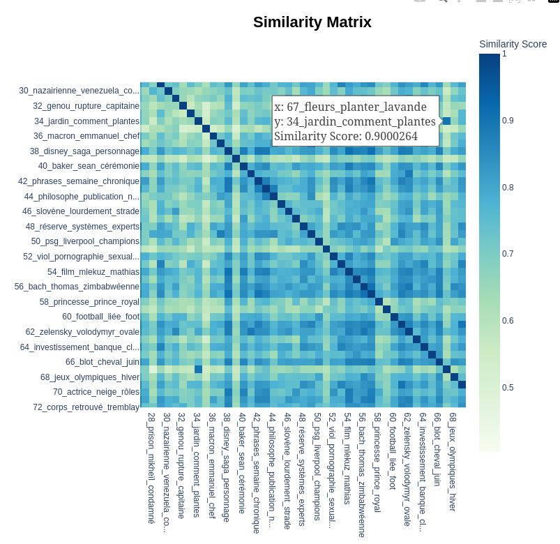

  Cette heatmap permet de visualiser la similarité entre les topics : plus le bleu est foncé, plus les topics sont similaires. La diagonale de la heatmap a la valeur maximale car elle correspond à l'endroit où le topic est associé à lui-même, donc la similarité est évidemment de 1 dans ce cas.

  Dans la capture d'écran, on voit que les topics 67 (fleurs_planter_lavande) et 34 (jardin_comment_plantes) sont notés comme étant très similaires avec un score de 0,90, très proche de 1. On peut facilement voir pourquoi, vu la présence de "plante" dans les deux topics, ainsi que des mots proches sémantiquement : fleurs, jardin et lavande.

  A l'inverse, le topic 28 (prison_mikheïl_condamné) est très peu similaire au topic 67, avec un score de similarité de 0,48, ce qui est logique étant donné l'éloignement sémantique entre "prison" et "fleurs".
  Cette heatmap nous permet de voir que BERTopic a plutôt bien analysé les topics.

  Regardons les topics sous forme hiérarchique.

  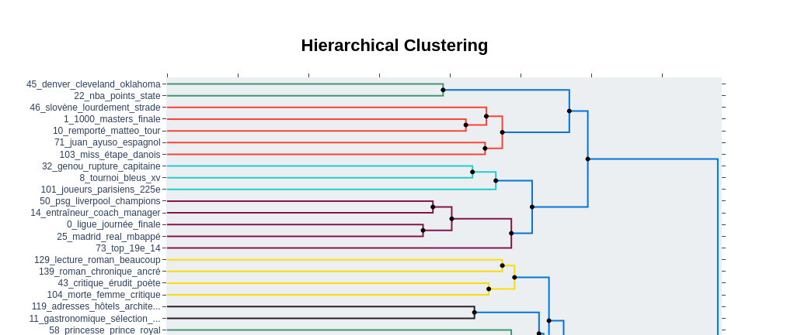

  Ici on peut voir un premier gros cluster regroupant les actualités sportives. On peut voir des sous-clusters correspondant à peu près aux différents sports : rugby, basket, football.

  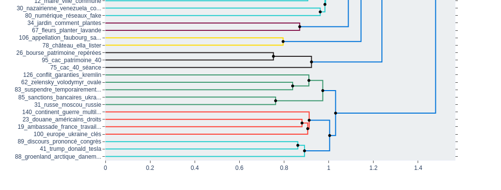

  Ici on peut voir un autre cluster, avec un sujet politique, comprenant des sous-clusters sur les tensions entre l'Ukraine et la Russie. Au dessus on voit un autre petit cluster rattaché à un autre gros cluster, qui lui regroupe les articles traitant de l'économie et de la bourse.

  Regardons les topics per class par catégories :

  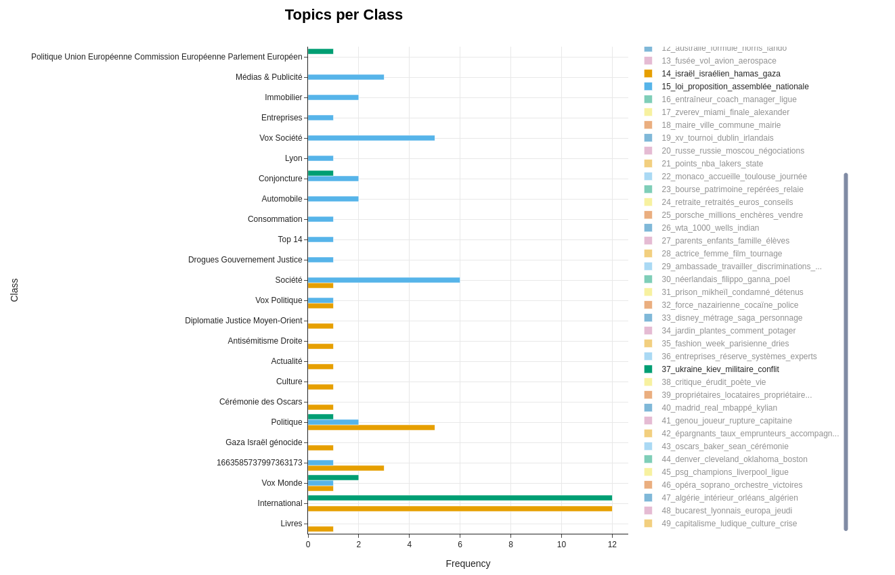

  Si on prend les topics "politique" On voit que certains d'entre eux partagent logiquement des catégories : notamment les topics "ukraine_kiev_militaire_conflit" et "israel_israelien_hamas_gaza" qui partagent les catégories "politique", "vox monde" et "international". Tout aussi logiquement, on voit que le topic "loi_proposition_assemblee_nationale" est absent de la catégorie "international" puisque c'est un sujet national.

  De la même manière, si on regarde les mêmes topics mais en triant par sources on obtient ceci :

  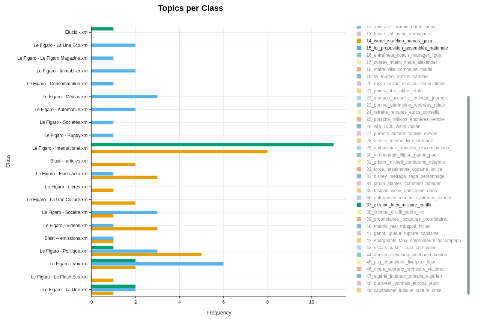

  Encore une fois on voit que le topic "loi_proposition_assemblee_nationale" est absent du flux Le Figaro - International. On voit aussi Blast ne traite pas du conflit Russie-Ukraine, mais traite uniquement du sujet "israel_israelien_hamas_gaza". A l'inverse, la source Elucid ne traite pas du sujet "israel_israelien_hamas_gaza", mais traite uniquement du conflit Russie-Ukraine. Enfin, on voit que le topic "loi_proposition_assemblee_nationale" est inclut dans des sources qui paraissent étranges : comme Le Figaro - Immobilier,  ou Le Figaro - Automobile. On peut donc se demander comment BERTopic a pu trouver ces sujets dans ces sources.


**--------------------------------------------------------------------------**

  - **Comparaison entre les deux sous-corpus** :

  Les résultats de BERTopic montrent une nette différence entre les deux corpus en termes de structure thématique. Le corpus de février contient 81 topics, tandis que celui de mars en comprend 142, ce qui indique une plus grande diversité des sujets traités en mars.

  Dans le corpus de février, les clusters sont bien structurés autour de domaines thématiques clairs. Au centre de la carte des distances inter-thématiques, un regroupement dense et hétérogène montre des sujets plus transversaux ou d’actualité générale. Quelques topics mal intégrés apparaissent également, révélant des limites dans la catégorisation automatique.

  En comparaison, le corpus de mars présente une carte bien plus dense et éclatée, avec plus de topics que février. Les clusters dominants concernent également le sport et les articles culturels/artistiques. Toutefois, des regroupements incohérents apparaissent : par exemple, un cluster à gauche mélange des articles sur les intempéries et les défilés, montrant une difficulté du modèle à distinguer ces contextes sémantiques.

  La heatmap des similarités confirme néanmoins la qualité de l’analyse : certains topics proches (par ex. jardin/plante) sont bien regroupés, tandis que d’autres sémantiquement éloignés (prison/fleur) sont clairement séparés.

  En conclusion, la comparaison entre les deux sous-corpus révèle une nette différence dans la densité, la diversité thématique et la structuration des topics. Le corpus de mars se distingue par un nombre plus élevé de topics et une organisation plus complexe, reflétant une plus grande hétérogénéité des contenus. En revanche, le corpus de février présente une structuration plus claire et des regroupements thématiques plus cohérents, mais une diversité plus limitée.


  * Problèmes et réflexions critiques :

  L'un des problèmes que nous avons rencontré est que certains articles n'ont pas de catégories. Pour pouvoir faire les topics per class en utilisant les catégories comme classes, nous sommes donc obligés de les retirer de l'analyse ce qui est dommage car cela enlève des données qui auraient pu intéressantes (on passe de 10000 à 5000 articles). De plus, à l'inverse, certains articles ont plusieurs catégories : or, BERTopic a besoin que chaque article soit associé à une classe. Lorsqu'un article a plusieurs catégories, nous avions essayé de séparer ces catégories afin que la liste de catégories finale `[['Economie', 'Immigration', 'Social'], 'Economie', 'Culture']` devienne `['Economie', 'Immigration', 'Social', 'Culture']`. Malheureusement cela fait que le nombre de classes n'est plus cohérent avec le nombre total d'articles et cela entraîne une erreur lors de l'exécution du script. On a donc été obligé de garder les combinaisons de catégories ensemble mais en les sortant de leur liste car BERTopic ne peut pas gérer une classe qui soit une liste. On a donc `['Economie Immigration Social', 'Economie', 'Culture']`.

  De plus, le fait d'avoir exclu les articles sans catégories pour pouvoir effectuer le topics per class par catégories se fait au détriment des topics per class par sources, puisque la plupart des articles sans catégories font partie des articles France Info, Libération... on perd donc des informations pour ces sources là. On se retrouve avec en majorité des articles venant du Figaro.


* **Comparaison critique des modèles (LDA vs BERTopic)** :
  * Lisibilité, cohérence, qualité des thèmes:

  BERTopic offre des résultats plus clairs et plus détaillés. Grâce à l’utilisation de modèles de langage comme BERT, il permet de regrouper les documents selon le sens des phrases, ce qui améliore la qualité des thèmes identifiés. Les visualisations comme les Intertopic Distance Maps ou les dendrogrammes montrent des clusters denses et bien structurés, notamment dans les domaines sportifs, culturels et sociaux. À l’inverse, LDA repose sur un modèle statistique plus ancien, basé sur le bag-of-words. Cela limite sa capacité à capturer le contexte sémantique, et certains de ses résultats paraissent moins précis ou mélangent plusieurs sujets dans un même thème.
  * Sur- ou sous-représentation de certains sujets: 

  LDA demande de fixer le nombre de topics à l’avance, ce qui peut entraîner une sous-représentation de certains sujets. BERTopic détermine automatiquement les clusters grâce à HDBSCAN, ce qui permet de mieux couvrir les thèmes émergents ou spécifiques. Cependant, un inconvénient de BERTopic est que chaque document n’est associé qu’à un seul topic, ce qui ne reflète pas toujours la réalité des textes. 
  * Réflexion sur l’impact du prétraitement :

  Enfin, en ce qui concerne le prétraitement, LDA exige un nettoyage important du texte en amont (stopwords, lemmatisation), tandis que BERTopic est plus souple : l'encodage peut se faire sans traitement, et seules les étapes de représentation du thème nécessitent un nettoyage plus classique

---
---

## {+ Conclusion +} :

Cette analyse nous a permis de mieux comprendre la manière dont des méthodes de modélisation thématique peuvent aider à structurer et interpréter de grands volumes de textes. En s’appuyant sur deux approches différentes – LDA et BERTopic – nous avons pu explorer la richesse des sujets présents dans les corpus étudiés, ainsi que la façon dont ces sujets s’organisent entre eux.

Globalement, les résultats mettent en évidence que la diversité des contenus, leur complexité et leur structuration évoluent d’un corpus à l’autre. Certains thèmes ressortent clairement, comme le sport, la culture ou encore la politique, tandis que d’autres apparaissent plus diffus, parfois mélangés à des sujets proches. Cette variation reflète à la fois la nature du contenu médiatique analysé et les limites des outils employés pour en extraire des thématiques cohérentes.

Les méthodes de topic modeling constituent un outil utile pour résumer l’information, identifier des tendances et explorer efficacement de larges ensembles de textes. Néanmoins, leur utilisation demande une attention particulière quant aux paramètres choisis, à la qualité des données analysées et aux objectifs visés. Chaque approche présente ses avantages : certaines privilégient une vision globale, alors que d'autres permettent une analyse plus détaillée et nuancée des contenus.

Cette exploration montre que l’automatisation de l’analyse thématique reste pertinentee pour mieux comprendre les grandes lignes d’un corpus textuel, à condition de bien en maîtriser les outils et les limites.

