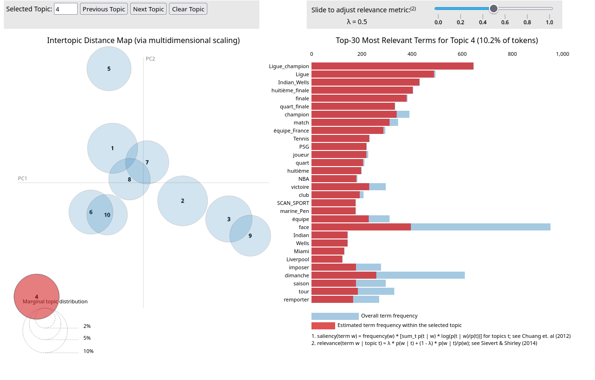
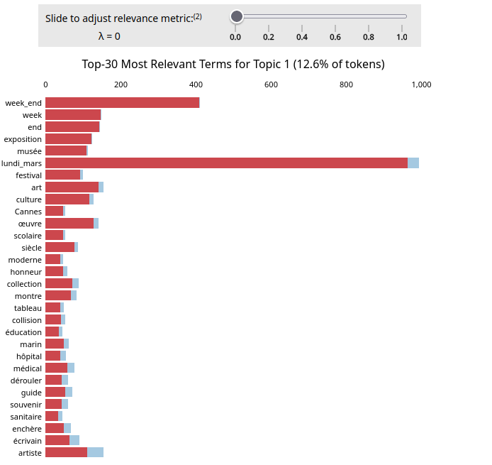

# Rapport Final

## {+ Introduction +} :

Ce projet vise à extraire, enrichir et analyser automatiquement des articles issus de flux RSS journalistiques de 2025. En combinant les outils de traitement du langage naturel (comme Trankit, Gensim, BERTopic et encore d'autres) et des méthodes de modélisations thématiques.

Ce rapport présente les étapes clés du projet, les choix techniques effectués, ainsi que les résultats obtenues et leurs limites.

Voilà un graphe simple qui représente la vue d'ensemble du projet :


(source : diapo "07-topics-modeling1.pdf")


---
---

### {- BàO 1 – gestion des données et du code -}

* **Contexte du projet** : Extraction et modélisation thématique de données issues de flux RSS journalistiques.

La première étape consiste de pouvoir lire et manipuler les données fournis au format XML (RSS). Il faut alors extraire le texte à analyser ainsi que les métadonnées qu'on aura besoin lors du filtrage. Les métadonnées qu'on garde sont : l'identifiant, la source, le titre de l'article, le contenu de l'article, la date dee publication et les catégories.

* **Composition de l’équipe et rôles**

Chaque personne a dû écrire une partie différente du programme à partir de librairie python différentes, mais qui font la même tâche. Le travail a été divisé en 3 rôles majeurs (R1, R2, R3).

* **Bibliothèques utilisés** : Python, GitLab, feedparser, re, etree, os, pahtlib, glob.
* **Scripts utilisés** :
  * `rss_reader.py`, `rss_parcours.py` : pour l'extraction (récursive) des flux RSS.
      * `rss_reader.py` [lien vers le script](https://gitlab.com/plurital-ppe2-2025/groupe11/Projet/-/blob/main/rss_reader.py#L11-115) : permet d'extraire les données d'un seul flux RSS.
      * `rss_parcours.py` [lien vers le script](https://gitlab.com/plurital-ppe2-2025/groupe11/Projet/-/blob/main/rss_parcours.py?ref_type=heads#L9-51) : permet d'extraire les données pour un ensemble de flux RSS et attend en entrée un dossier contenant plusieurs fichiers.

  * Débogage et relecture collaboratif, gestion des dépendances et erreurs courantes.
  * Gestion du code avec Git avancé : historique Git, conflits, évolution des scripts.

---
---

### {- BàO 2 – enrichir les données -}

La seconde étape est d'enrichir les données avec les sorties de différents analyseurs morphosyntaxiques : `SpaCy`, `Stanza` et `Trankit`. Ces outils permettent d’extraire des informations linguistiques telles que les lemmes, les catégories grammaticales, etc. Ces résultats permettent de construire une représentation plus solide et précise des structures linguistiques contenues dans les données.

* **Structure initiale des fichiers RSS**.
* **Nettoyage et prétraitement** :
  * Agrégation des données
  * Suppression des doublons : grâce à la [fonction `supprimer_doublons()`](https://gitlab.com/plurital-ppe2-2025/groupe11/Projet/-/blob/main/rss_parcours.py?ref_type=heads#L115)

  ```python
  def supprimer_doublons(articles):
	"""Supprime les doublons d'articles basés sur leur l'id"""
	vus = set()
	uniques = []
	for article in articles:
		cle = getattr(article, 'id', None)
		if cle and cle not in vus:
			vus.add(cle)
			uniques.append(article)
	return uniques
    ```


  * Sauvegarde au format XML, Json et Pickle :
    Voici des exemples de fichiers après la sauvegarde en fonction des formats :
      - Sauvegarde en XML [fichier xml](corpus_février.xml)
      - Sauvegarde en JSON [fichier_json](corpus_février.json)
      - Sauvegarde en Pickle [fichier_pickle](corpus_février.pickle)

* **Analyse automatique** :
  * Scripts :
    - `datastructures.py` : contient les différentes @dataclass afin de stocker des valeurs et créer une structure aux données.
    - `analyzers.py` : enrichi avec le résultat de l'analyse.
  * Représentation des objets à partir de [@dataclass](https://gitlab.com/plurital-ppe2-2025/groupe11/Projet/-/blob/main/datastructures.py?ref_type=heads#L9-186): `Article`, `Token`, `Corpus`.
  * Lemmatization et morphosyntaxe via [spacy](https://gitlab.com/plurital-ppe2-2025/groupe11/Projet/-/blob/main/analyzers.py?ref_type=heads#L74-83), [stanza](https://gitlab.com/plurital-ppe2-2025/groupe11/Projet/-/blob/main/analyzers.py?ref_type=heads#L60-68) et [Trankit](https://gitlab.com/plurital-ppe2-2025/groupe11/Projet/-/blob/main/analyzers.py?ref_type=heads#L21-47) (POS, lemme).
  * Problèmes :
    - Pour Trankit, il faut version de python 10.0. Cela signifie de créer un nouvel environnement virtuel ayant la version de python adapté afin d'utiliser la librairie Trankit.

* **Filtrage sur métadonnées** :
  * Création de sous-corpus filtré :

  On avait plusieurs filtres au choix :
      - filtre en fonction des [dates](https://gitlab.com/plurital-ppe2-2025/groupe11/Projet/-/blob/main/rss_reader.py?ref_type=heads#L118-141).
      - filtre en fonction des [catégories](https://gitlab.com/plurital-ppe2-2025/groupe11/Projet/-/blob/main/rss_reader.py?ref_type=heads#L144-150).
      - filtre en fonction de la [source](https://gitlab.com/plurital-ppe2-2025/groupe11/Projet/-/blob/main/rss_reader.py?ref_type=heads#L152-166).

  Tous ces filtres ont été rassemblé dans une nouvelle fonction `filtrage()` :

  ```python
      def filtrage(articles, date_debut=None, date_fin=None, sources=None, categories=None):
        """Applique tous les filtres spécifiés aux articles"""
        articles_filtres = []
        id_unique = set()

        for article in articles:
            # Vérifier tous les filtres applicables
            if date_debut is not None or date_fin is not None:
                if not filtre_date(article, date_debut, date_fin):
                    continue

            if sources:
                if not filtre_source(article, sources):
                    continue

            if categories:
                if not filtre_categories(article, categories):
                    continue

            # Si l'article passe tous les filtres et n'est pas un doublon
            if article.id not in id_unique:
                id_unique.add(article.id)
                articles_filtres.append(article)

        return articles_filtres
    ```

  Pour ce projet, le corpus original intitulé `Corpus au 2 avril 2025`. Nous avons décidé de le filtrer en fonction des dates, en conservant que les mois de février et de mars. Ce filtrage nous a semblé pertinent pour analyser l'évolution des thématiques au fil du temps. Ce découpage permet de comparer les dynamiques informationnelles selon les périodes, de repérer des intérêts autour de certains sujets, ou encore de limiter les effets de surreprésentation de thèmes liés à des événements ponctuels. Il renforce ainsi la pertinence de l’analyse thématique en contextualisant les résultats dans une chronologie cohérente.

  >Voici un exemple de commandes utilisées pour obtenir les sous-corpus :
      ```
      python3 rss_parcours.py 2025/ glob etree --start-date 2025-02-01 --end-date 2025-02-28 --output corpus02.json
      ```
      ```
      python3 rss_parcours.py 2025/ glob etree --start-date 2025-03-01 --end-date 2025-03-31 --output corpus_mars.json
      ```

  On a donc 2 sous-corpus : `sous-corpus_février` et `sous-corpus_mars`. On obtient environ 10000 articles au total.

---
---

### {- BàO 3 – Visualisation -}

* **Visualisations** :
  * `visualize_topics()`, `visualize_topics_per_class()`, `visualize_hierarchy()`, `visualize_heatmap()`.
  * Mise en forme des sorties pour l'interprétation.
  * Liens vers les fichiers HTML de visualisation.

* **Rédaction du rapport** :
  - **Corpus février** :
    * Résultats obtenus, limites et pertinence des outils utilisés.

    Voici nos différentes visualisations obtenues pour le corpus de février :
    * [Visualisation des topics](https://gitlab.com/plurital-ppe2-2025/groupe11/Projet/-/blob/main/sous-corpus_f%C3%A9vrier/topics_corpus_f%C3%A9vrier_analyzed.html?ref_type=heads)
    * [Visualisation hiérarchique des topics](https://gitlab.com/plurital-ppe2-2025/groupe11/Projet/-/blob/main/sous-corpus_f%C3%A9vrier/hierarchical_topics_corpus_f%C3%A9vrier_analyzed.html?ref_type=heads)
    * [Visualisation de tous les documents et leur topic](https://gitlab.com/plurital-ppe2-2025/groupe11/Projet/-/blob/main/sous-corpus_f%C3%A9vrier/topics_embeddings_corpus_f%C3%A9vrier_analyzed.html?ref_type=heads)
    * [Visualisation de la heatmap des similarités entre topics](https://gitlab.com/plurital-ppe2-2025/groupe11/Projet/-/blob/main/sous-corpus_f%C3%A9vrier/topics_heatmap_corpus_f%C3%A9vrier_analyzed.html?ref_type=heads)
    * [Visualisation des topics par classe de corpus février selon les catégories](https://gitlab.com/plurital-ppe2-2025/groupe11/Projet/-/blob/main/sous-corpus_f%C3%A9vrier/topics_per_class_categories_corpus_f%C3%A9vrier_analyzed.html?ref_type=heads)
    * [Visualisation des topics par classe de corpus février selon les sources](https://gitlab.com/plurital-ppe2-2025/groupe11/Projet/-/blob/main/sous-corpus_f%C3%A9vrier/topics_per_class_sources_corpus_f%C3%A9vrier_analyzed.html?ref_type=heads)

  - **Corpus mars** :
    * Résultats obtenus, limites et pertinence des outils utilisés.

    Voici nos différentes visualisations obtenues pour le corpus de mars :
    * [Visualisation des topics](https://gitlab.com/plurital-ppe2-2025/groupe11/Projet/-/blob/main/sous-corpus_mars/topics_corpus_mars_analyzed.html?ref_type=heads)
    * [Visualisation hiérarchique des topics](https://gitlab.com/plurital-ppe2-2025/groupe11/Projet/-/blob/main/sous-corpus_mars/hierarchical_topics_corpus_mars_analyzed.html?ref_type=heads)
    * [Visualisation de tous les documents et leur topic](https://gitlab.com/plurital-ppe2-2025/groupe11/Projet/-/blob/main/sous-corpus_mars/topics_embeddings_corpus_mars_analyzed.html?ref_type=heads)
    * [Visualisation de la heatmap des similarités entre topics](https://gitlab.com/plurital-ppe2-2025/groupe11/Projet/-/blob/main/sous-corpus_mars/topics_heatmap_corpus_mars_analyzed.html?ref_type=heads)
    * [Visualisation des topics par classe selon les catégories](https://gitlab.com/plurital-ppe2-2025/groupe11/Projet/-/blob/main/sous-corpus_mars/topics_per_class_categories_corpus_mars_analyzed.html?ref_type=heads)
    * [Visualisation des topics par classe selon les sources](https://gitlab.com/plurital-ppe2-2025/groupe11/Projet/-/blob/main/sous-corpus_mars/topics_per_class_sources_corpus_mars_analyzed.html?ref_type=heads)

  * Propositions d'améliorations futures :
    * interface web ...
    * clustering supervisé ...
    * suivi temporel des thèmes ...


---
---

### {- BàO 4 – Analyse -}

> [!LDA]
> * **Modélisation thématique avec LDA** :
  * Script : `run_lda.py`
  * Outils : Gensim ...
  * Prétraitement : stopwords, vectorisation.

* **Analyse des résultats** :
    
     Analysons les résultats que nous avons obtenu avec le script LDA. Nous avons choisi de garder les dix topics les plus fréquents pour les deux sous-corpus.
    - **Corpus février** :
    
    Voici notre visualisation LDA pour le corpus de février :
  


    Le résultat de visualisation LDA montre ici un modèle à 10 topics, dans lequel le topic 1 représente 12,2% des tokens du corpus – ce qui en fait un des sujets dominants. Sur la carte de gauche, nous observons que le topic 1 est regroupé avec les topics 2, 3, 5, 6, 8 et 9, ce qui suggère une proximité sémantique. Le topic 10, isolé en haut à gauche, semble thématiquement distinct. Le topic 4 est également un peu éloigné, indiquant une certaine indépendance thématique.

    Le curseur λ (lambda) contrôle le critère de sélection des mots-clés :

    λ = 1 (réglage actuel) : les mots sont classés selon leur fréquence dans le topic (représentativité interne) ;

    λ = 0 : les mots sont classés selon leur spécificité au topic (exclusivité thématique) ;

    λ = 0.5 : compromis entre les deux.

    Modifier λ permet donc de varier le point de vue sur les topics : soit en favorisant les mots les plus fréquents, soit en mettant en avant ceux qui différencient vraiment un topic des autres.

    La barre rouge indique la fréquence estimée du terme dans le topic sélectionné ; La barre bleue indique la fréquence du même terme dans l’ensemble du corpus.


   * Problèmes et réflexions critiques.:

    <!-- Le graphique à barres à droite présente les 30 termes les plus fréquents pour le topic 1. Parmi eux, on retrouve des mots comme "vin" ou "xv_France" sont très fréquents, mais rares dans les autres topics. Ces termes sont donc fortement spécifiques au Topic 1 et peuvent être considérés comme des indicateurs sémantiques clés de ce cluster.  -->
    
    Bien que le Topic 1 contienne plusieurs termes cohérents comme “France”, “français”, “xv_France”, qui renvoient clairement à un topic sportif, notamment le rugby (XV de France), on observe également la présence de termes d’un tout autre domaine, tels que “logement”, “propriétaire”, “prix”, qui relèvent plutôt du champ social et économique.


    On peut donc en conclure que le Topic 1 reflète une agrégation partiellement bruitée, où la frontière entre les sujets n’est pas suffisamment nette. Cela pourrait s’expliquer par un manque de granularité dans les embeddings, un nombre de topics trop faible, ou encore un corpus où les thèmes sont souvent entremêlés.


    - **Corpus mars** :

   Analysons les résultats que nous avons obtenu avec le script LDA. Nous avons choisi de garder les dix topics les plus fréquents pour les deux sous-corpus.

  > Voici notre visualisation LDA pour le corpus de mars :
  

  Nous voyons ici les différents topics, et la distance qu'il y a entre chacun d'entre eux. Nous voyons sur l'image le topic 4, qui semble représenter un sujet sportif comme on peut le voir avec les termes "ligue_champion", "PSG", "Tennis", etc. Nous avons le terme "marine_pen" qui semble être une valeur aberrante. On observe que certains termes sont plus spécifiques que d'autres : par exemple "ligue_champion" est plus spécifique que "dimanche" car on voit que pour le premier terme, la fréquence du terme au sein du topic est quasi la même que la fréquence total tout topic confondu, contrairement à "dimanche" dont la fréquence relative au topic est égale à moins de la moitié de la fréquence total du terme.

  

  Dans cette image, on voit le topic 1. Même en mettant lambda à 0 pour essayer d'avoir les termes les plus spécifiques, il est difficile de dégager un thème dans ce topic. Il a l'air d'être lié à la culture et l'art, mais on a des mots comme "médical" qui sont surprenants.

  Voici le fichier texte comprenant les dix premiers topics : [fichier txt](https://gitlab.com/plurital-ppe2-2025/groupe11/Projet/-/blob/main/sous-corpus_mars/topics_lda_mars.txt?ref_type=heads)

  On remarque que la plupart des topics sont de nature politique.

  * Problèmes et réflexions critiques.
>

**--------------------------------------------------------------------------**

> [!BERTopic]

> * **Modélisation thématique avec BERTopic** :
  * Script : `bertopicdemo.py`
  * Outils : Gensim ...
  * Prétraitement : stopwords, vectorisation.
  * Modèle Hugginface : sentence-transformers/paraphrase-multilingual-MiniLM-L12-v2

* **Analyse des résultats** :

    - **Corpus février** :

  Voici un aperçu de l’analyse de hierarchical clustering sur les topics du corpus de février:

  
    Ce dendrogramme nous permet de visualiser les similarités sémantiques entre les différents topics extraits par BERTopic. Chaque ligne horizontale correspond à un topic identifié par un numéro et des mots-clés représentatifs. Les points de jonction (nœuds noirs) indiquent le regroupement de deux topics en un cluster plus large. 
    
    En survolant ces nœuds, on peut voir apparaître un nom de regroupement généré automatiquement, ce qui permet d’interpréter rapidement le thème global du cluster. Par exemple, les topics `66_alpes_edgar_grospiron` et `38_ski_2030_olympique` sont regroupés très tôt avec l’étiquette `2030_alpes_jo_comité_ski`, suggérant une forte proximité lexicale autour des Jeux Olympiques d’hiver. 
    
    Ce type de visualisation aide donc à mieux comprendre la structure hiérarchique des sujets traités dans le corpus, à identifier les thèmes centraux (branches courtes) ainsi que les sujets plus marginaux ou spécifiques (branches longues). 


    - **Corpus mars** :

  Voici un aperçu en zoomant à un endroit de la heatmap :

  

  Cette heatmap permet de visualiser la similarité entre les topics : plus le bleu est foncé, plus les topics sont similaires. La diagonale de la heatmap a la valeur maximale car elle correspond à l'endroit où le topic est associé à lui-même, donc la similarité est évidemment de 1 dans ce cas.

  Dans la capture d'écran, on voit que les topics 67 (fleurs_planter_lavande) et 34 (jardin_comment_plantes) sont notés comme étant très similaires avec un score de 0,90, très proche de 1. On peut facilement voir pourquoi, vu la présence de "plante" dans les deux topics, ainsi que des mots proches sémantiquement : fleurs, jardin et lavande.

  A l'inverse, le topic 28 (prison_mikheïl_condamné) est très peu similaire au topic 67, avec un score de similarité de 0,48, ce qui est logique étant donné l'éloignement sémantique entre "prison" et "fleurs".
  Cette heatmap nous permet de voir que BERTopic a plutôt bien analysé les topics.

  - **Comparaison entre les deux sous-corpus** :


  * Problèmes et réflexions critiques :

  L'un des problèmes que nous avons rencontré est que certains articles n'ont pas de catégories. Pour pouvoir faire les topics per class en utilisant les catégories comme classes, nous sommes donc obligés de les retirer de l'analyse ce qui est dommage car cela enlève des données qui auraient pu intéressantes (on passe de 10000 à 5000 articles). De plus, à l'inverse, certains articles ont plusieurs catégories : or, BERTopic a besoin que chaque article soit associé à une classe. Lorsqu'un article a plusieurs catégories, nous avions essayé de séparer ces catégories afin que la liste de catégories finale `[['Economie', 'Immigration', 'Social'], 'Economie', 'Culture']` devienne `['Economie', 'Immigration', 'Social', 'Culture']`. Malheureusement cela fait que le nombre de classes n'est plus cohérent avec le nombre total d'articles et cela entraîne une erreur lors de l'exécution du script. On a donc été obligé de garder les combinaisons de catégories ensemble mais en les sortant de leur liste car BERTopic ne peut pas gérer une classe qui soit une liste. On a donc `['Economie Immigration Social', 'Economie', 'Culture']`.
>

* **Comparaison critique des modèles (LDA vs BERTopic)** :
  * Lisibilité, cohérence, qualité des thèmes.
  * Sur- ou sous-représentation de certains sujets.
  * Réflexion sur l’impact du prétraitement.

---
---

## {+ Conclusion +} :

---

## Annexes

* Extraits de code avec commentaires (liens GitLab).
* Graphique Git des contributions.
* Fichier `requirements.txt` avec les bibliothèques utilisées.


